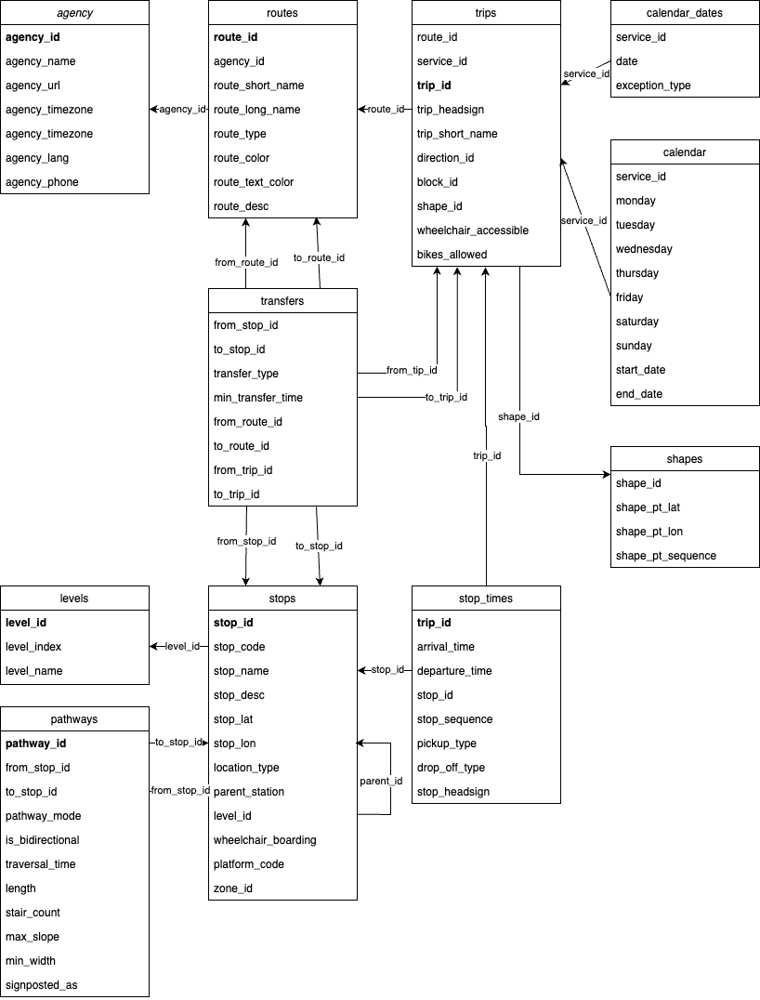

## Übungsblatt 3

Die Suche nach Haltestellen soll in dieser Übung erweitert werden. Auch die Anzeige in Ihrer Liste wird ausgebaut, sodass Nutzerinnen und Nutzer nicht nur die Stationen suchen können, sondern auch weitere Informationen zu Linien und Haltestellen angezeigt bekommen.

Sie arbeiten auch in dieser Übung mit den Ergebnissen aus Übung 2 weiter. Stellen Sie deswegen sicher, das ihr bisheriger Code gut funktioniert und Sie bereits ein Qt-Projekt und ein funktionierendes Fenster als Grundgerüst implementiert haben.

Für die Durchführung verwenden Sie wieder die GTFS-Daten, welche Sie im Übungs-Repository finden (https://gtfs.org/schedule/reference).

## GTFS-Datenstruktur

Die Daten im GTFS-Format liegen strukturiert vor und die einzelnen Dateien stehen in Verbindung miteinander. Diese Verbindungen zu erkennen und zu verstehen ist schwierig wenn nur die Dateien analysiert werden. Die folgende Grafik soll dabei helfen Ihnen die Zusammenhänge zu verdeutlichen.



Jede Linie der U- und S-Bahnen in Berlin ist mit einer Zeile in der Datei `routes.txt` gespeichert. Jede Linie hat eine eindeutige ID (`route_id`). Sie sehen im Feld `route_short_name`, dass einige Linien mehrfach auftauchen (wie bspw. die **S3**). Dies liegt an unterschiedlichen Start- und Endhaltestellen. 

Jede Fahrt auf einer Linie ist als Eintrag in der Datei `trips.txt` gespeichert. Zu welcher Linie die Fahrt gehört ist über das Feld `route_id` erkennbar. Jede Fahrt wiederum hat ebenfalls eine eindeutige Nummer - die `trip_id`.
Die Information aus welchen Haltestellen eine Fahrt besteht wird über die Einträge in der Datei `stop_times.txt` ermittelt. Jeder Halt ist über die `trip_id` mit der Fahrt verbunden zu der er gehört. Zusätzlich finden Sie Informationen zu Ankunft (`arrival_time`), Abfahrt (`departure_time`) und Nummer des Halts auf der Fahrt (`stop_sequence`) in der Datei. 

Zum Schluss muss noch die Information bereitgestellt werden, an welchem Bahnhof oder Gleis der Halt stattfindet. Dazu verfügt jeder Eintrag in `stop_times.txt` über das Feld `stop_id`. Diese ID gehört zu einem eindeutigen Eintrag in der Datei `stops.txt`. Hier sind alle Haltestellen gespeichert und besitzen mit der `stop_id` eine eindeutige Nummer. Um zu ermitteln ob es sich bei der Haltestelle um einen Bahnhof oder ein einzelnen Gleis handelt kann das Feld `location_type` verwendet werden. Ist hier der Wert `0` gespeichert handelt es sich um ein Gleis und im Feld `parent_station` ist die ID der Haltestelle des Bahnhofs gespeichert. Bahnhöfe besitzen den Wert `1` im Feld `location_type` (https://gtfs.org/documentation/schedule/reference/#stopstxt).

Diese Informationen reichen für die Bearbeitung dieser Übung aus. Informieren Sie sich selbst über den Inhalt der anderen Dateien.

## Linien auswählen

Wie unter Punkt *GTFS-Datenstruktur* beschrieben sind alle Linien im Netzplan in der Datei `routes.txt` abgespeichert und sind durch Ihre Implementierung in Übung 1 in Ihrer `Network`-Klasse im Attribut `routes` verfügbar.

In dieser Teilaufgabe erweitern Sie die Oberfläche um ein neues Auswahlfeld (eine sog. Combo Box). In diesem sollen die verfügbaren Linien angezeigt werden. Die Anwendung soll wieder alle Methoden zur Berechnung von Daten in die Network-Klasse integrieren und vom Code zur Darstellung trennen.

- Implementieren Sie in Ihrer Network-Klasse eine Methode getRoutes. Diese erhält keine Parameter und gibt einen `std::vector<bht::Route>` mit allen verfügbaren Linien zurück. 
```cpp
std::vector<bht::Route> getRoutes();
```

- Für die Anzeige der Linien in der Combo Box soll der `route_short_name` verwendet werden. Ist ebenfalls ein `route_long_name` angegeben wird dieser dahinter in Klammern angezeigt. Implementieren Sie für die Anforderung eine Methode in der `Network`-Klasse, welche die Linie als Parameter übergeben bekommt und den anzuzeigenden String zurückgibt mit folgender Signatur:

```cpp
std::string getRouteDisplayName(bht::Route route);
```

- Erweitern Sie Ihre grafische Oberfläche so, dass über Ihrem Suchfeld für die Stationen aus Übung 2 eine Combo Box angezeigt wird (`QComboBox`)
- In der Combo Box werden alle Linien mit ihrem Anzeigenamen aufgeführt. Verwenden Sie Ihre neuen Methoden `getRoutes` und `getRouteDisplayName` in der `Network`-Klasse um die Elemente für die Combo Box zu ermitteln.

## Fahrt auswählen

Ist eine Linie ausgewählt kann der\*die Anwender\*in eine Fahrt auf dieser Linie auswählen für die weitere Details angezeigt werden sollen.
Durch die Auswahl einer Linie kennen sie die ID der Linie (Feld id im Typ Route). Wie in *GTFS-Datenstruktur* beschrieben ist dies die `route_id`, mit der Sie alle Fahrten finden können, welche zu der Linie gehören. Die Fahrten sind in dem Attribute `trips` Ihrer `Network`-Klasse gespeichert.

- Finden Sie zu der ausgewählten ID der Route alle Fahrten indem Sie in allen Einträgen der Map `trips` nach Einträgen suchen, bei denen die `routeId` mit der ID der gewählten Route übereinstimmt. Implementieren Sie diese Suche nach Fahrten einer Linie in einer eigenen Methode in Ihrer `Network`-Klasse.

```cpp
std::vector<Trip> getTripsForRoute(std::string routeId);
```

- Um eine einzelne Fahrt gut lesbar darzustellen implementieren Sie in der `Network`-Klasse eine Methode zur Umwandlung einer `Trip`-Datenstruktur in einen String. Eine Fahrt soll dabei in der Form `<shortName> - <headsign>` angezeigt werden.

```cpp
std::string getTripDisplayName(bht::Trip trip);
```

- Erweitern Sie Ihre grafische Oberfläche um eine weitere `QComboBox` unter der Combo Box für die Auswahl der Linie. 
- Zeigen Sie in dieser Combo Box alle Fahrten der ausgewählten Linie an. Zeigen Sie Einträge in der Form an, wie sie die Methode `getTripDisplayName` zurückgibt.

## QListView zum QTableView
Nachdem in den beiden Combo Boxen Einträge ausgewählt sind sollen in dem Bereich darunter Informationen zu den Haltestellen dieser Linie angezeigt werden.

- Implementieren Sie eine Methode in der Network-Klasse, mit der zu einem Fahrt alle Halte abgerufen werden können in der Reihenfolge, wie sie angefahren werden (also sortiert nach dem Feld `stopSequence`).

```cpp
std::vector<StopTime> getStopTimesForTrip(std::string tripId);
```

- Außerdem benötigen Sie eine Methode, mit der Sie eine Haltestelle zu dessen ID abfragen können. Implementieren Sie in der `Network`-Klasse eine passende `getter`-methode hierfür:

```cpp
Stop getStopById(std::string stopId);
```

- Die Tabelle besitzt folgende Spalten: "**Nr.**", "**Name Haltestelle**", "**Ankunftszeit**", "**Abfahrtszeit**"
- Ermitteln Sie alle Haltestellen der ausgewählten Fahrt mit Ihrer Methode `getStopTimesForTrip`.
- Zeigen Sie für jede Haltestelle eine Zeile in der Tabelle an. Verwenden die Felder `arrivalTime`, `departureTime` und `stopSequence` für die Spalten "Ankunftszeit", "Abfahrtszeit" und "Nr.".
- Ermitteln Sie über Ihre Methode `getStopById` die Daten zur Haltestelle des Halts und zeigen dessen Namen in der Spalte "Name Haltestelle" an.
- Ihr Suchfeld für die Suche nach Haltestellen und die neue Ergebnis-Tabelle sind so lange inaktiv (`enabled = false`), bis ein Eintrag in der Combo Box für die Linie und ein Eintrag in der Combo Box für die Fahrt ausgewählt wurde.

## Suche in der Tabelle

Verändern Sie die Suche mit Ihrem Suchfeld so, dass nun in den Elementen in der Tabelle gesucht werden kann. Erhalten Sie jedoch ihre alte Such-Funktion in der Klasse Network, wir benötigen Sie zu einem späteren Zeitpunkt noch.

- Implementieren Sie eine Methode in der Network-Klasse, mit der zu einem Fahrt alle Halte abgerufen werden können in der Reihenfolge, wie sie angefahren werden gefiltert nach einem Such-String.

```cpp
std::vector<StopTime> searchStopTimesForTrip(std::string query, std::string tripId);
```
- Verwenden Sie diese Methode um die Ergebnisse der Tabelle zu filtern.

## Abgabe und automatische Auswertung

Die automatische Auswertung prüft die Methoden aus den angegebenen Aufgaben. Außerdem wird Ihre grafische Oberfläche mit automatisierten Tests geprüft. Dazu wird die Anwendung mit `qmake` erstellt und ausgeführt. 

Sie finden im Repository der Übungsaufgabe eine Datei `tester.cpp`. Diese Datei enthält die Testfälle für Ihre Anwendung. Diese können Sie sich ansehen und selbst prüfen ob Ihre Anwendung diese Testfälle erfüllt. Die Tests werden mit dem Googletest-Framework realisiert (https://github.com/google/googletest).

Die Datei `tester.cpp` darf von Ihnen **nicht** verändert werden. Die Integrität der Datei wird bei der automatischen Auswertung per Prüfsumme verifiziert.

Die folgenden Anforderungen werden in der Abgabe geprüft:
- Die Anwendungen kann übersetzt werden mit qmake.
- Die Datei `tester.cpp` ist unverändert.
- Ihre Abgabe enthält wieder ein `Makefile` mit dem Target `autotest`, welche Die Datei `tester.cpp` mit den benötigten Quellcode-Dateien übersetzt und die Datei `test_runner` erzeugt. Der Befehl zum Übersetzen Ihrer Anwendung sollte wieder beginnen mit dem unten genannten Kommando gefolgt von Ihren C++-Quelldateien (außer denen mit der main-Methode und dem QT-Fenster)

```bash
g++ -I. -I/usr/local/include -std=c++17 -o test_runner /usr/local/lib/libgtest_main.a /usr/local/lib/libgtest.a tester.cpp <Ihre CPP-Dateien...>
```
- Die Unit-Tests für die Aufgaben können ohne Fehler ausgeführt werden.
- Eine Plagiatsprüfung findet keine Treffer.
